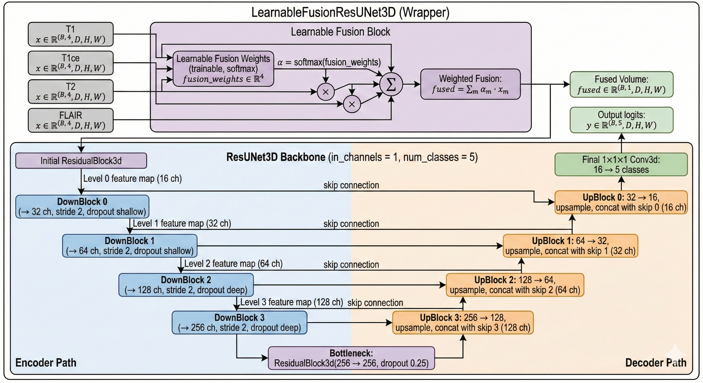
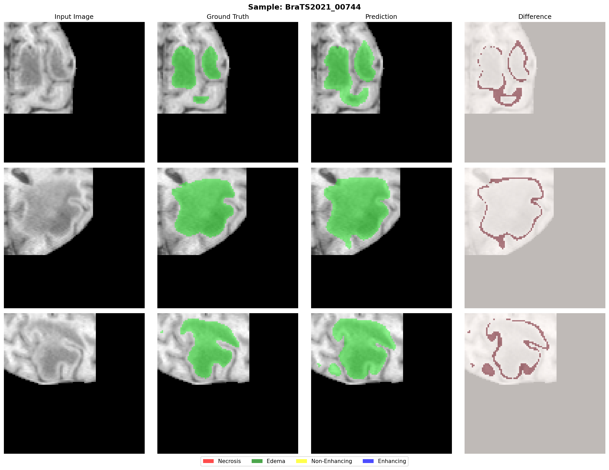

# Brain Tumor Segmentation in MRI using 3D Residual U-Net with Learnable Multimodal Fusion

This repository contains the official implementation of our project on **3D Brain Tumor Segmentation** using multimodal MRI data (T1, T1ce, T2, FLAIR). Our approach focuses on improving multimodal information integration through a **Learnable Fusion Module** and a robust **3D Residual U-Net (ResUNet3D)** architecture, optimized for performance under realistic compute constraints like Kaggle T4 GPUs.

---

## 🚀 Key Features

- **3D Residual U-Net (ResUNet3D)**: Advanced backbone architecture with residual connections to ensure stable gradient flow and capture fine-grained spatial details.
- **Learnable Multimodal Fusion**: A custom module that adaptively weights different MRI modalities (T1, T1ce, T2, FLAIR) instead of using simple averaging or concatenation.
- **Combined Dice + Focal Loss**: A robust multi-class loss function that balances region overlap optimization with effective handling of class imbalance in tumor sub-regions.
- **Optimized for Kaggle T4 GPUs**: Innovative strategies including:
  - **Patch-based Sampling**: Efficient 3D processing using $98 \times 98 \times 98$ patches.
  - **Tumor-Centric & Class-Aware Sampling**: Ensuring the model sees enough tumor voxels and minority classes (necrosis, enhancing tumor).
  - **Automatic Mixed Precision (AMP)** & **Gradient Accumulation**.
- **Comprehensive Evaluation**: Metrics calculated include macro tumor Dice, IoU, and BraTS conventions (Whole Tumor, Tumor Core, Enhancing Tumor).

---

## 🏗️ Architecture

The model consists of two main components:
1. **Learnable Fusion Module**: Takes 4 input MRI modalities and learns a set of softmax-normalized weights to produce a single fused feature volume.
2. **ResUNet3D Backbone**: A 4-level deep residual U-Net with:
   - Level-wise residual blocks.
   - InstanceNorm3d for stable training.
   - Strategic Dropout (shallow vs. deep level rates) for regularization.

---

## 📊 Results

Our model, **LearnableFusionResUNet3D**, achieved significant improvements over the baseline ResUNet3D.

### Summary Metrics (BraTS Convention)

| Metric | LearnableFusionResUNet3D | Baseline ResUNet3D |
| :--- | :---: | :---: |
| **Macro Tumor Dice** | **0.8292** | 0.6851 |
| **Whole Tumor (WT)** | **0.8563** | 0.7811 |
| **Tumor Core (TC)** | **0.9056** | 0.8504 |
| **Enhancing Tumor (ET)** | **0.8430** | 0.7418 |

### Per-Class Dice & IoU (Learnable Fusion)

| Class | Dice Score | IoU Score |
| :--- | :---: | :---: |
| Background | 0.9854 | 0.9715 |
| Necrosis | 0.7349 | 0.6406 |
| Edema | 0.7387 | 0.6033 |
| Non-Enhancing | 1.0000 | 1.0000 |
| Enhancing | 0.8430 | 0.7459 |

### Visual Ground Truth Comparison

---

## 📁 Project Structure

- `Full_ResUnet3D_Pipeline.ipynb`: The main end-to-end implementation including training, evaluation, and ablations.
- `ResUnet3DResults/`: Directory containing quantitative and qualitative results.
- `requirements.txt`: Environment dependencies.
- `aggregated_results.txt`: Detailed raw experimental data.

---

## 🛠️ Installation & Usage

### ⚙️ Prerequisites
- Python 3.8+
- PyTorch (with CUDA support recommended)
- SimpleITK
- scikit-learn
- tqdm
- Matplotlib

### 🏃 Running the Pipeline
The easiest way to run the project is via the provided Jupyter Notebook:
1. Open `Full_ResUnet3D_Pipeline.ipynb`.
2. Configure your dataset path in the `TrainConfig` class (Phase 1).
3. Execute the cells sequentially or use the automated orchestration pipelines in Phase 9.

---

## 👥 Meet the Team

| Name | Role / Phase Focus |
| :--- | :--- |
| **Shruthi** | Setup, Data Preprocessing, Dataset Utils, Fusion Implementation |
| **Hrishikesh** | Backbone Architecture, Training Loop, Test Evaluation, Pipeline Orchestration |
| **Nihal** | Robust Evaluation, Ablation Studies, Result Export, Documentation |

---

## 📜 Acknowledgements
- **Dataset**: Provided by the [BraTS 2021 Challenge](http://braintumorsegmentation.org/).
- **Inspiration**: Building upon established works in U-Net, ResNet, and Swin-UNet architectures for medical imaging.

---
© 2026. This project was developed as part of the CV-Segmentation coursework at IIIT Sri City.
